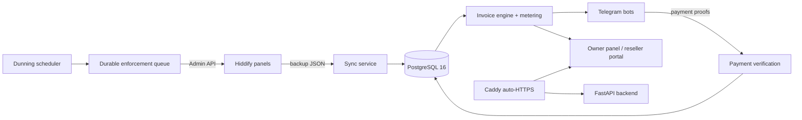

# Hiddify Reseller Invoicing System

[](https://github.com/Alighaemi9731/hiddify-invoice-system/actions/workflows/ci.yml)

**Automated billing, payments, and enforcement for a multi-panel Hiddify VPN reseller
business.** Every month the system pulls usage from every Hiddify panel, computes each
reseller's invoice from the quota they actually sold, delivers it over Telegram, collects
crypto/card payments, and — if a reseller doesn't pay — runs a reminder → warning →
suspension cycle through the Hiddify Admin API, restoring service automatically on
payment. It replaces an error-prone manual desktop workflow with a fully audited,
self-hosted product.

Runs in production against ~10 panels and ~400 resellers. Owner UI is **Persian (RTL)**;
all money is Toman with live crypto conversion.

---

## What it does

### Billing engine
- **One rule, everywhere**: each reseller (with their whole sub-reseller subtree bundled)
  is billed for the **quota sold** — `Σ usage_limit_GB × price_per_GB` over services
  *created that Gregorian month* — with a configurable free-test threshold, per-reseller
  price overrides, and per-reseller exemptions.
- **Abuse-resistant metering**: reset-aware cumulative counters catch "reset usage daily"
  and "renew by editing quota" tricks and bill the missed volume as explicit extra line
  items, with per-user breakdowns sent to the reseller.
- **Safe regeneration**: one invoice per (reseller, period) — paid invoices are never
  recomputed, drafts are cheap to discard, and re-running a period can never duplicate or
  disturb settled accounting.
- **Durable financial ledger**: every invoice's money facts are mirrored to an
  append-style ledger that survives data wipes and panel/reseller removal.

### Payments
- USDT (BEP-20), TON, AVAX and card-to-card — each method individually toggleable.
- Live Toman rates (Tetherland/Wallex primary, CoinGecko-derived AVAX) with plausibility
  guards and manual fallback; every proof is tied to explicitly selected invoices and
  confirmed manually, with optional on-chain verification for USDT.
- Confirm/reject is fully reversible, settles exactly the selected invoice set, and
  lifting a suspension on payment is a durable queued operation — not a request-path
  side effect.

### Telegram bots
- **Main bot** (owner + resellers): registration bound to the reseller's real panel
  link, channel/group membership gating, invoice delivery with per-node GB-only PDFs,
  a locked mistake-proof pay flow, sub-reseller management (suspend / freeze / GB caps /
  capacity bumps), interim current-month invoices, and an owner ops menu.
- **Storefront bots** (multi-tenant): every top-level reseller can run their *own*
  customer-facing shop bot — plans, wallet & top-ups, credit codes, auto-provisioning
  with QR, renewals, trials, broadcasts — supervised by one manager process that
  reconciles the fleet from the database.
- Both bots use docked reply-keyboard menus with FSM-locked flows: a flow always shows a
  cancel exit and the correct menu always returns when the flow ends.

### Reseller web portal
- One-tap login from the bot via strictly single-use tokens (no passwords), RTL Persian
  UI, full storefront administration in the browser with a machine-verified guarantee of
  **parity** with the bot: every admin capability maps to the same audited command layer,
  so there is no portal-only mutation bypass.

### Enforcement (dunning)
- Configurable D+3 / D+5 / D+10 / D+30 reminder → warning → suspension timeline per unpaid
  invoice, re-anchored automatically when the owner grants a payment deadline.
- Suspension and restore are **durable queue actions** processed in bounded, resumable
  chunks using Hiddify's native bulk operations — safe at thousands-of-users scale, with
  snapshots of prior limits for exact restore. Defaults to **dry-run** until explicitly
  enabled.
- A limits-only **freeze** mode stops a sub-reseller from creating/expanding users while
  keeping existing users online.

### Owner web panel
Dashboard (sales, collection, debtors) · Panels (sync health) · Resellers (list + tree
hierarchy, capacity meters) · Invoices · Payments · Debts · Sales · Financial history ·
Logs · Broadcast · Tools (user recovery, ops) · Backup/restore · Settings (every runtime
knob — schedules, pricing, texts, payment methods — editable live, secrets encrypted).

---

## Architecture



| Component | Technology |
|---|---|
| Backend API + scheduler | Python 3.12, FastAPI, SQLAlchemy 2.0 (async), APScheduler, Alembic |
| Telegram bots | aiogram v3 (multi-bot storefront fleet + main bot in one container) |
| Database | PostgreSQL 16 (Docker volume, automated `pg_dump` backups) |
| Frontend | React + Vite + TypeScript, MUI (RTL, Vazirmatn), ECharts |
| PDFs | reportlab + arabic-reshaper + python-bidi (Persian RTL) |
| Ingress | Caddy — automatic HTTPS, SPA + API routing |
| Delivery | Docker Compose; checksum-verified immutable release archives |

```
backend/   FastAPI app: core (config/db/crypto/security), models, schemas, API routers,
           services (sync, invoice engine, metering, payments, dunning, enforcement,
           storefront, PDFs, backups), bot handlers, scheduler jobs, Alembic migrations
frontend/  Persian RTL SPA (owner panel + reseller/storefront portal)
deploy/    production compose, one-line installer, release packaging, rollback, updater
docs/      architecture, database, release process, versioning
```

---

## Install (fresh Ubuntu server)

```bash
tmp="$(mktemp -d)" && cd "$tmp"
curl -fLO https://github.com/Alighaemi9731/hiddify-invoice-system/releases/latest/download/release-installer.sh
curl -fLO https://github.com/Alighaemi9731/hiddify-invoice-system/releases/latest/download/release-installer.sh.sha256
sha256sum -c release-installer.sh.sha256
sudo bash release-installer.sh
```

The installer asks nothing: it installs Docker, resolves one release tag, downloads its
immutable archive, **verifies the published SHA-256 before any code runs as root**, and
brings up the whole stack. Open the printed `http://<server-ip>` — the one-time setup
wizard takes a username, password, and (optionally) a domain; with a domain, Caddy
fetches a certificate and the panel moves to `https://<domain>` automatically.

- **Update** — from the panel («به‌روزرسانی سامانه», via a host-side systemd watcher) or
  `sudo bash deploy/release-installer.sh` on the server. Same verified-archive path.
- **Rollback** — `sudo bash deploy/rollback.sh vX.Y.Z` from the offline release cache,
  migration-aware (refuses a code-only rollback across a schema change).
- The database is **never** wiped by install, update, or rollback. Schema evolves through
  versioned Alembic migrations on boot, serialized by a Postgres advisory lock.
- Details: [`deploy/README.md`](deploy/README.md).

### First steps after install

1. **Settings** → set the Telegram bot token; `/start` the bot as owner.
2. **Panels** → add each Hiddify panel (admin link + API key) and sync.
3. **Settings** → pricing, payment methods (wallets/card), message templates, schedules.
4. **Invoices** → generate a period, review drafts, send. The scheduler automates the
   monthly run, reminders, syncs, rate refresh, and backups thereafter.
5. When ready for real enforcement, flip `enforcement_enabled` (defaults to dry-run).

---

## Security model

- Secrets (panel keys, bot tokens, wallet data) are **Fernet-encrypted at rest**, masked
  on API reads, and never committed — bootstrap in `.env`, runtime config in the DB.
- Owner auth: bcrypt + CAPTCHA + rate limiting (proxy-aware) + optional TOTP 2FA and
  passkeys; JWTs carry a token epoch so a password change kills stolen tokens; setup is
  single-shot and race-proof.
- Portal/bot links are single-use, allow-listed, and server-authorized; payment txids are
  chain-validated and canonicalized; every mutation flows through audited commands.
- Releases are immutable, checksum-verified archives; CI runs hash-locked dependency
  installs, Ruff, mypy, the full test suite (including concurrency contract tests against
  real Postgres), frontend type-check/tests/build with a bundle budget, and validates the
  deploy stack. GitHub Actions are SHA-pinned.
- Encrypted-capable automatic backups (`pg_dump`) ship to the owner over Telegram;
  restore is atomic and self-sufficient across servers.

---

## Development

```bash
# Backend gate
cd backend && source .venv/bin/activate
ruff check app tests alembic && mypy app && python -m pytest

# Frontend gate
cd frontend && npx tsc --noEmit && npm test -- --run && npm run build
```

- Tests default to SQLite; concurrency-invariant tests are marked `pg_contract` and run
  against real PostgreSQL 16 in CI.
- **Single-branch policy**: all work lands directly on `main`; CI gates every push and
  releases are tagged only from green commits. No feature/release/bot branches, ever.
- Process docs: [`docs/RELEASE_PROCESS.md`](docs/RELEASE_PROCESS.md) ·
  [`docs/VERSIONING.md`](docs/VERSIONING.md)

## Documentation

| Document | Contents |
|---|---|
| [`docs/ARCHITECTURE.md`](docs/ARCHITECTURE.md) | Full system design, data model, flows, diagrams |
| [`docs/DATABASE.md`](docs/DATABASE.md) | Schema evolution, migrations, backup/restore semantics |
| [`docs/RELEASE_PROCESS.md`](docs/RELEASE_PROCESS.md) | Release gate, packaging, deploy, smoke, rollback |
| [`docs/VERSIONING.md`](docs/VERSIONING.md) | MAJOR/MINOR/PATCH rules |
| [`deploy/README.md`](deploy/README.md) | Production stack internals, installer, updater |

---

*Private, single-operator production system. Not accepting external contributions.*
