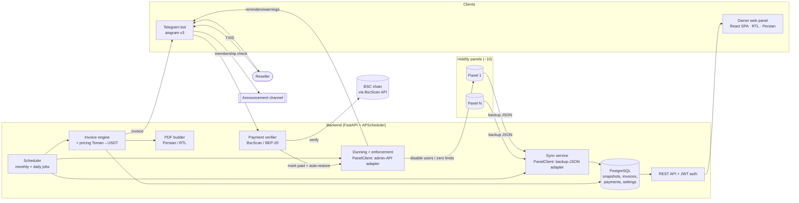
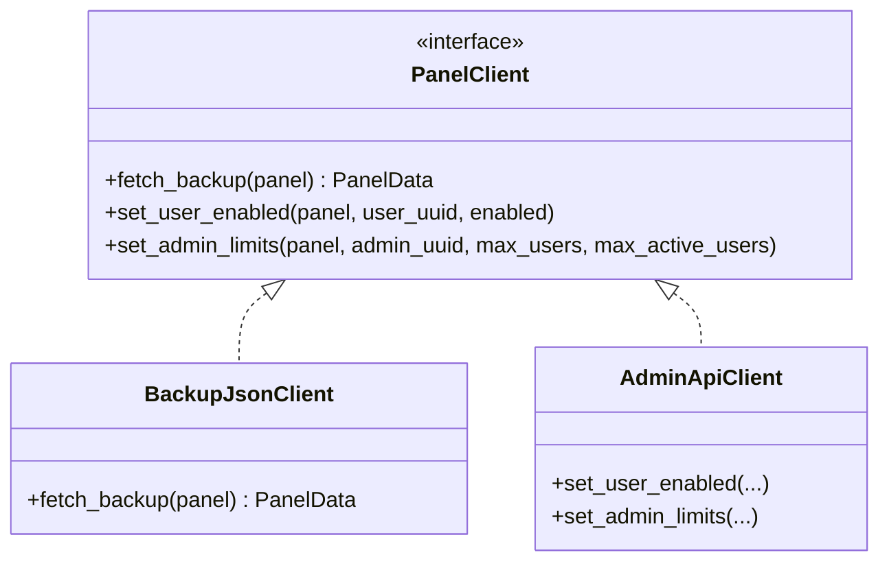

# Architecture

Hiddify Reseller Management & Invoicing System — Phase 1 (localhost MVP).

## 1. Overview

The system automates what was previously a manual monthly process: read every Hiddify
panel, work out what each reseller sold, bill them, deliver the invoice on Telegram,
take payment in USDT (BEP-20), and chase/suspend non-payers.

Design principles:

- **One source of usage truth:** each panel's backup JSON (read), snapshotted into Postgres.
- **Write only where needed:** enforcement (disable users / zero limits) uses the Hiddify Admin REST API; everything else is read-only.
- **Bootstrap vs runtime config:** `.env` only bootstraps; the owner edits everything else from the web panel (stored in DB, secrets encrypted).
- **Phase-2-ready:** modular services, a `PanelClient` interface, and a scheduler that can move to systemd later — no rewrite.

## 2. Components & data flow



## 3. Monthly invoicing sequence

```mermaid
sequenceDiagram
    participant S as Scheduler
    participant SY as Sync
    participant E as Invoice engine
    participant B as Bot
    participant R as Reseller
    participant V as Payment verifier
    participant P as Hiddify panel

    S->>SY: sync all panels (start of month)
    SY->>P: GET backup JSON
    P-->>SY: admins + users
    SY->>SY: upsert resellers + end_user_snapshots
    S->>E: generate invoices for previous month
    E->>E: bundle sub-resellers; Σ usage_limit_GB of services created in month (skip 1GB); ×price; →USDT
    E->>B: send invoice
    B->>R: invoice text (+ wallet address)
    Note over S,R: if unpaid → D+2 reminder, D+4 reminder, D+5 warning + enforcement (dry-run unless enabled)
    R->>B: submit TXID
    B->>V: verify on-chain (dest, amount, confirmations)
    V-->>B: confirmed
    V->>P: (if enforced) re-enable users + restore limits
    B->>R: payment confirmed
```

## 4. Reseller ↔ Telegram matching

The bot gates on **announcement-channel membership** (`getChatMember`), then asks the
reseller to paste their panel link, e.g.
`https://<host>/<path>/<uuid>/#<tag>`. The system parses **host + path + uuid**
(rest ignored): `path` identifies the panel, `uuid` matches `resellers.admin_uuid`,
`#tag` is stored as `link_tag`. On match we bind `bot_chat_id` so invoices/reminders
reach that reseller. `panel_telegram_id` (when the panel has it) is a secondary auto-match.

## 5. PanelClient interface



Read path = `BackupJsonClient` (the `/admin/backup/backupfile/` endpoint). Write path =
`AdminApiClient` (Hiddify Admin REST API, needs the per-panel admin API key). Enforcement
uses the write path; a future REST read adapter and HD-wallet payment monitor slot in here.

## 6. Deployment (Phase 1)

`docker compose` runs four services: `db` (Postgres), `backend` (API + scheduler),
`bot` (aiogram polling), `frontend` (nginx serving the built SPA). The bot and backend
share the same code image and DB; the backend's scheduler instantiates a Telegram `Bot`
only to *send* invoices/reminders (the `bot` service owns polling). Phase 2 swaps compose
for a one-line installer + systemd units + Caddy for domain/TLS.
