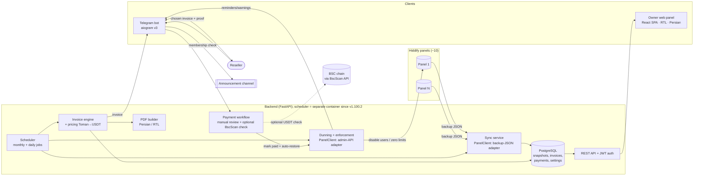
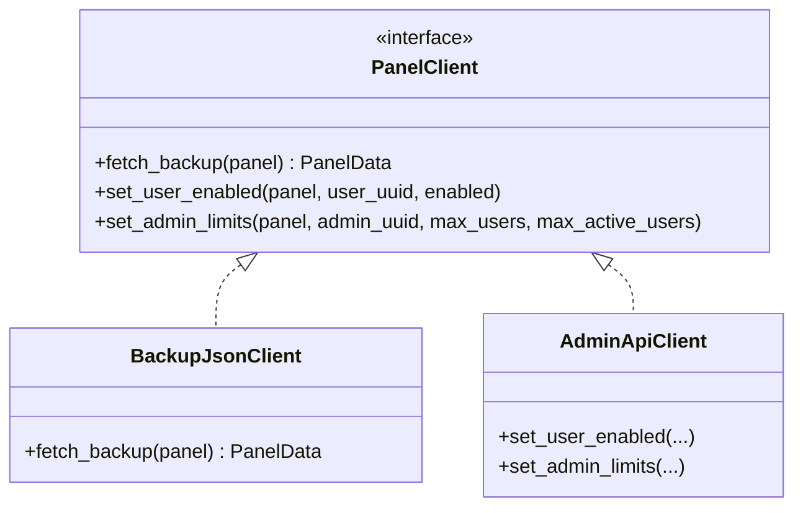

# Architecture

Hiddify Reseller Management & Invoicing System — production architecture.

## 1. Overview

The system automates what was previously a manual monthly process: read every Hiddify
panel, work out what each reseller sold, bill them, deliver the invoice on Telegram,
collect owner-confirmed payments, and chase/suspend non-payers.

Design principles:

- **One source of usage truth:** each panel's backup JSON (read), snapshotted into Postgres.
- **Write only where needed:** enforcement (disable users / zero limits) uses the Hiddify Admin REST API; everything else is read-only.
- **Bootstrap vs runtime config:** `.env` only bootstraps; the owner edits everything else from the web panel (stored in DB, secrets encrypted).
- **Phase-2-ready:** modular services, a `PanelClient` interface, and a scheduler that can move to systemd later — no rewrite.

## 2. Components & data flow

```mermaid
flowchart LR
    subgraph Panels["Hiddify panels (~10)"]
        P1[(Panel 1)]
        P2[(Panel N)]
    end

    subgraph Backend["Backend (FastAPI); scheduler = separate container since v1.100.2"]
        SYNC[Sync service<br/>PanelClient: backup-JSON adapter]
        DB[(PostgreSQL<br/>snapshots, invoices,<br/>payments, settings)]
        ENGINE[Invoice engine<br/>+ pricing Toman→USDT]
        PDF[PDF builder<br/>Persian / RTL]
        DUN[Dunning + enforcement<br/>PanelClient: admin-API adapter]
        PAY[Payment workflow<br/>manual review + optional BscScan check]
        API[REST API + JWT auth]
        SCHED[Scheduler<br/>monthly + daily jobs]
    end

    subgraph Clients
        WEB[Owner web panel<br/>React SPA · RTL · Persian]
        BOT[Telegram bot<br/>aiogram v3]
    end

    RESELLER([Reseller])
    CHAIN[(BSC chain<br/>via BscScan API)]
    CHANNEL[[Announcement channel]]

    P1 -- backup JSON --> SYNC
    P2 -- backup JSON --> SYNC
    SYNC --> DB
    SCHED --> SYNC
    SCHED --> ENGINE
    SCHED --> DUN
    ENGINE --> DB
    ENGINE --> PDF
    DB --> API
    API --> WEB
    ENGINE -- invoice --> BOT
    DUN -- reminders/warnings --> BOT
    DUN -- disable users / zero limits --> P1
    BOT <--> RESELLER
    BOT -- membership check --> CHANNEL
    RESELLER -- chosen invoice + proof --> BOT
    BOT --> PAY
    PAY -. optional USDT check .-> CHAIN
    PAY -- mark paid + auto-restore --> DUN
```

## 3. Monthly invoicing sequence

```mermaid
sequenceDiagram
    participant S as Scheduler
    participant SY as Sync
    participant E as Invoice engine
    participant B as Bot
    participant R as Reseller
    participant V as Payment review
    participant P as Hiddify panel

    S->>SY: sync all panels (start of month)
    SY->>P: GET backup JSON
    P-->>SY: admins + users
    SY->>SY: upsert resellers + end_user_snapshots
    S->>E: generate invoices for previous month
    E->>E: bundle sub-resellers; Σ usage_limit_GB of services created in month (skip 1GB); ×price; →USDT
    E->>B: send invoice
    B->>R: invoice text + exact-invoice payment button
    Note over S,R: if unpaid → D+2 reminder, D+4 reminder, D+5 warning + enforcement (dry-run unless enabled)
    R->>B: choose invoice; submit TXID/receipt
    B->>V: create pending payment for that invoice
    V->>V: owner reviews manually
    Note over V: USDT/BSC can optionally be checked through BscScan
    V-->>B: owner confirms
    V->>P: (if enforced) re-enable users + restore limits
    B->>R: payment confirmed
```

## 4. Reseller ↔ Telegram matching

The bot gates on **announcement-channel membership** (`getChatMember`), then asks the
reseller to paste their panel link, e.g.
`https://<host>/<path>/<uuid>/#<tag>`. The system parses **host + path + uuid**
(rest ignored): `path` identifies the panel, `uuid` matches `resellers.admin_uuid`,
`#tag` is stored as `link_tag`. On match we bind `bot_chat_id` so invoices/reminders
reach that reseller. `panel_telegram_id` (when the panel has it) is a secondary auto-match.

Database schema changes are versioned under `backend/alembic/versions`. On startup, fresh
databases migrate from the baseline to head. An older database without `alembic_version` is
stamped at the baseline only after all expected tables and columns are present; PostgreSQL
uses an advisory lock so the backend and bot cannot race the migration.

## 5. PanelClient interface

```mermaid
classDiagram
    class PanelClient {
        <<interface>>
        +fetch_backup(panel) PanelData
        +set_user_enabled(panel, user_uuid, enabled)
        +set_admin_limits(panel, admin_uuid, max_users, max_active_users)
    }
    class BackupJsonClient {
        +fetch_backup(panel) PanelData
    }
    class AdminApiClient {
        +set_user_enabled(...)
        +set_admin_limits(...)
    }
    PanelClient <|.. BackupJsonClient
    PanelClient <|.. AdminApiClient
```

Read path = `BackupJsonClient` (the `/admin/backup/backupfile/` endpoint). Write path =
`AdminApiClient` (Hiddify Admin REST API, needs the per-panel admin API key). Enforcement
uses the write path. New read/payment adapters should be introduced only with an implemented
workflow and migration, not as dormant enum values.

## 5b. Reseller web portal & storefront management surface

The reseller-facing SPA at `/portal/*` is fully independent of the owner app (own auth context,
own `portal_token`). A reseller reaches it from their Telegram bot: the bot mints a short-lived,
single-use login token (`portal_auth.create_portal_login_token`) inside an HTTPS URL; the SPA's
`/portal/login` posts it to `POST /api/portal/auth/exchange`, which consumes the token's `jti`
(via `portal_login_nonce`, strictly one-time) and returns a 30-day sliding reseller JWT
(`role=reseller`). Every `/api/portal/*` route depends on `get_current_reseller` (secure-transport
gate + a per-request reseller-row check, so unbinding a reseller revokes access immediately).

Resellers who run a per-reseller VPN storefront bot manage the whole shop from
`/api/portal/storefronts/*` (`portal_storefront.py`), which is backed by the SAME shared, audited,
idempotent command/query layer the storefront bot uses — `storefront_admin` (money + config mutations,
each one transaction with an idempotency claim + audit event), `storefront_customers`/`storefront_reporting`
(tenant-scoped reads), `storefront_provision` (panel I/O). A machine-readable parity inventory
(`backend/tests/fixtures/storefront_admin_parity.json`) plus `tests/test_storefront_parity.py` prove
every admin-bot capability has a portal equivalent and that no portal mutation handler bypasses the
shared layer with a direct session write (an AST no-bypass scan). The storefront-admin bot is a compact
inline home for the owner whose HTTPS button opens the portal directly; co-admins keep the full legacy
bot keyboard (no portal RBAC). Login/notification deep-links carry a `next` that is validated by a
strict default-deny allowlist (`app/core/portal_deeplink.validate_next`: only `/portal/storefront/{id}`
+ a registered SPA suffix; rejects schemes, `//`, backslashes, control chars, `..`, double-encoding) and
then tenant-authorized by `POST /api/portal/authorize-next` (`require_owned_storefront`), so a stale or
forged `next` degrades to the owner's dashboard with no open redirect and no cross-tenant existence leak.

## 6. Deployment

Production Compose runs `db`, `backend`, `bot`, `frontend`, and `caddy`. The bot and
backend share the same code image and DB; only the backend runs scheduler jobs. Caddy
provides same-origin API routing and automatic TLS. Backend readiness calls `/health`,
which executes `SELECT 1`; Caddy does not start until that database-aware probe is healthy.

Production updates never execute a mutable branch script as root. Each GitHub Release
contains an application archive and SHA-256 file. The host updater resolves one exact tag,
verifies the archive, applies its tracked-file manifest, rebuilds, and runs
`deploy/smoke.sh`. Verified archives remain in `update/releases` and
`deploy/rollback.sh vX.Y.Z` reapplies a cached prior release without network access.

`deploy/docker-compose.staging.yml` is an isolated validation stack: separate named
volumes, localhost-only ingress, scheduler disabled, and no Telegram bot. It is suitable
for Playwright/workflow checks without touching production data or external chats.

## 7. Quality gates

Backend Docker and CI installs use pip-compiled, hash-locked manifests. Backend CI runs
`pip check`, Ruff, mypy, and pytest. The integrated workflow gate executes billing,
manual payment confirmation, financial-ledger persistence, and creation of a readable
database backup. Alembic drift is checked against a freshly migrated database.

Frontend installs use `npm ci`; CI also runs `npm audit`. Vite/Rolldown splits large
dependencies into bounded React, UI, data, animation, ECharts, and zrender chunks.
`npm run build` runs TypeScript checking and enforces a 500 KiB maximum per JS chunk.

Repeating scheduler jobs use `IntervalTrigger` with a fixed Tehran-local epoch anchor.
This preserves true spacing for non-divisor values such as 7 hours or 17 minutes while
remaining stable across restarts. Monthly invoicing and daily dunning remain calendar cron
jobs. All schedule settings, including `rate_refresh_hours`, are live-applied.

The active enums intentionally contain only values produced by implemented workflows.
Migration `3f2a7c91b8e4` normalizes obsolete labels from older installations before the
application reads them.
